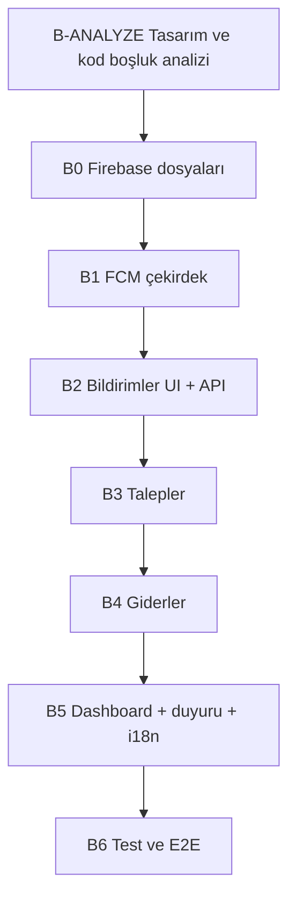

# AidatPanel — Flutter Faz 2A Entegrasyon Planı (AI / Mobil Ekip)

> **Bu dosyanın amacı:** Backend’de hazır olan gider, talep ve bildirim + FCM özelliklerini Flutter’a bağlamak.  
> **Hedef kitle:** Mobil geliştirici ve **yapay zeka asistanı** (bu dosya prompt olarak verilebilir).  
> **Backend durumu (2026-05-19):** Faz 2A+ API ve push tetikleyicileri tamam; `backend/test.py` → 120 OK.  
> **Ön koşul:** Faz 1 mobil (auth, bina, aidat, profil) çalışır durumda.

---

## Nasıl kullanılır (AI için)

1. **Her oturumda önce [B-ANALYZE](#b-analyze-zorunlu-ilk-adım)** bölümünü uygula; eski analiz raporlarına veya sohbet özetlerine güvenme.
2. Backend tek doğruluk kaynağıdır: `backend/src/`, `backend/prisma/schema.prisma`, `backend/test.py`.
3. Çakışmada sıra: **kod > `FLUTTER-BACKEND.md` > `PLAN.md` > bu dosya**.
4. Her aşama bitince **Çıkış kriterleri** kutusunu işaretle; sonraki aşamaya geç.
5. Kapsam dışı özellikleri UI’da “hazır” gösterme (dekont upload, RevenueCat kilidi, WhatsApp/SMS, PDF rapor).

**İlgili dosyalar:**

| Dosya | İçerik |
|-------|--------|
| [`FLUTTER-BACKEND.md`](FLUTTER-BACKEND.md) | Endpoint + JSON sözleşmesi (bazı push tipleri güncellenmiş olabilir — B-ANALYZE ile doğrula) |
| [`PLAN.md`](PLAN.md) | B0–B6 özet aşamalar |
| [`PLAN_BACKEND_PUSH.md`](PLAN_BACKEND_PUSH.md) | Backend push tamamlama notları |
| [`AIDATPANEL.md`](AIDATPANEL.md) | Ürün özeti |
| [`backend/postman/AidatPanel-Notifications.postman_collection.json`](backend/postman/AidatPanel-Notifications.postman_collection.json) | Manuel API test |
| [`YUSUF_YAPILANLAR_BİLDİRİM.md`](YUSUF_YAPILANLAR_BİLDİRİM.md) | Bildirim / Postman notları |
| [`DOKUMANTASYON.md`](DOKUMANTASYON.md) | Tüm `.md` bütünlük indeksi |

---

## Özet yol haritası



| Aşama | Süre (tahmini) | Bağımlılık |
|-------|----------------|------------|
| **B-ANALYZE** | 0,5–1 gün | — |
| **B0** | 0,5 gün | — |
| **B1** | 1 gün | B0 |
| **B2** | 1–1,5 gün | B1 (push için); API tek başına paralel |
| **B3** | 1–1,5 gün | Auth, `apartmentId` |
| **B4** | 1 gün | Seçili `buildingId` |
| **B5** | 0,5 gün | B2–B4 |
| **B6** | 0,5 gün | Backend + gerçek cihaz |

---

# B-ANALYZE (ZORUNLU İLK ADIM)

> **Kritik kural:** Bu adımı **implementasyona başlamadan önce** çalıştır.  
> Daha önce yapılmış statik “tasarım eksikleri” listeleri **güncel olmayabilir** (ekip arayüzü kısmen tamamlamış olabilir).  
> Görevin: **o anki** `mobile/` kod tabanını backend ve tasarım sistemiyle karşılaştırıp **güncel bir gap raporu** üretmek.

## B-ANALYZE.1 — Backend envanteri (kod taraması)

Aşağıdakilerin **gerçekten var ve mount edilmiş** olduğunu doğrula (dosya yolları):

| Alan | Kontrol listesi |
|------|-----------------|
| Bildirimler | `GET/PATCH /notifications`, `read-all`, `PUT /me/fcm-token` |
| Talepler | `GET /me/tickets`, `GET/POST` bina/apartman/ticket uçları, `updates`, `status` |
| Giderler | `GET/POST .../expenses`, `summary`, `PUT/DELETE /expenses/:id` |
| Duyuru | `POST .../announcements` |
| Aidat hatırlatma | `POST .../dues/remind` |
| Push tetikleyiciler | `backend/src/services/ticketService.js`, `dueService.js`, `dueReminderService.js`, `announcementService.js` |

**Bildirim tipleri** (`backend/src/constants/notificationConstants.js` + Prisma enum):

| `type` | Ne zaman | Alıcı | Deep link `data` (örnek) |
|--------|----------|--------|---------------------------|
| `TICKET_CREATED` | Sakin yeni talep | Yönetici | `ticketId`, `buildingId`, `apartmentId`, `category`, `status`, `route` |
| `TICKET_UPDATE` | Not / durum değişimi | Talep sahibi sakin | `ticketId`, `buildingId`, `status`, `route` |
| `ANNOUNCEMENT` | Yönetici duyuru | Tüm aktif sakinler | `buildingId`, `route` |
| `DUE_PAID` | Aidat `PAID` | Daire sakini | `dueId`, `buildingId`, `apartmentId`, `month`, `year`, `route` |
| `DUE_REMINDER` | `POST .../dues/remind` | İlgili sakinler | `dueId`, `buildingId`, … |
| `SYSTEM` | Dev/E2E | Test | `route` |
| `DEKONT_*` | — | Faz 2B | **UI bağlama** |

## B-ANALYZE.2 — Mobil envanteri (kod taraması)

Repoda **şu an** ara (grep / glob); sonuçları gap raporuna yaz:

```bash
# Örnek komutlar (workspace kökünden)
rg -l "firebase|Firebase|fcm|FCM" mobile/lib
rg -l "features/notifications|features/tickets|features/expenses" mobile/lib
rg "issuesTab|comingSoon|placeholder" mobile/lib -i
rg "buildingExpenses|myTickets|notificationsReadAll|dues/remind|announcements" mobile/lib
ls -la mobile/lib/features/notifications mobile/lib/features/tickets mobile/lib/features/expenses
test -f mobile/lib/firebase_options.dart && echo "firebase_options: VAR" || echo "YOK"
test -f mobile/android/app/google-services.json && echo "google-services: VAR" || echo "YOK"
```

**Doldurulacak tablo (AI çıktısı — örnek şablon, değerleri sen doldur):**

| Kontrol | Backend hazır? | Mobil dosya/UI var mı? | Gap / not |
|---------|----------------|-------------------------|-----------|
| FCM init + token upload | ✅ | ? | |
| Bildirim listesi + okundu | ✅ | ? | |
| `TICKET_CREATED` deep link (yönetici) | ✅ | ? | |
| `TICKET_UPDATE` deep link (sakin) | ✅ | ? | |
| `DUE_PAID` / `DUE_REMINDER` gösterim | ✅ | ? | |
| Sakin talep sekmesi (placeholder değil) | ✅ | ? | |
| Yönetici talep listesi/detay | ✅ | ? | |
| Yönetici gider CRUD + özet | ✅ | ? | |
| Yönetici duyuru formu | ✅ | ? | |
| `ApiConstants` eksik sabitler | — | ? | aşağıdaki listeyle diff |

## B-ANALYZE.3 — `ApiConstants` diff

`mobile/lib/core/constants/api_constants.dart` dosyasını backend path’leriyle karşılaştır. **Eksik olması muhtemel sabitler** (varlığını B-ANALYZE’de doğrula):

```dart
static const notificationsReadAll = '$apiVersion/notifications/read-all';
static String apartmentTickets(String apartmentId) =>
    '$apiVersion/apartments/$apartmentId/tickets';
static String ticketStatus(String ticketId) =>
    '$apiVersion/tickets/$ticketId/status';
static String buildingExpensesSummary(String buildingId) =>
    '$apiVersion/buildings/$buildingId/expenses/summary';
static String buildingAnnouncements(String buildingId) =>
    '$apiVersion/buildings/$buildingId/announcements';
static String buildingDuesRemind(String buildingId) =>
    '$apiVersion/buildings/$buildingId/dues/remind';
```

`expenseProof` backend Faz 2A’da **yok** — kullanılmıyorsa kaldır veya Faz 2B’ye bırak.

## B-ANALYZE.4 — Tasarım sistemi ve UX boşlukları (canlı kod)

**Referans dosyalar (mevcut kalıp):**

- `mobile/lib/core/theme/app_colors.dart`, `app_typography.dart`, `app_sizes.dart`
- `mobile/lib/features/dues/presentation/screens/resident_dues_tab.dart` (liste + durum)
- `mobile/lib/features/dues/presentation/screens/manager_dues_tab.dart`
- `mobile/lib/features/buildings/presentation/screens/building_residents_screen.dart`
- `mobile/lib/shared/widgets/empty_state_widget.dart`, `toast_overlay.dart`

**İncele ve raporla (eskiden bilinen eksikler değil — şu anki kodu oku):**

| Ekran / akış | Sorular |
|--------------|---------|
| Sakin dashboard — “Arızalar” sekmesi | Hâlâ `Center(Text(issuesTab))` mi? Liste + FAB var mı? |
| Ayarlar — Bildirimler | `comingSoon` toast mu, gerçek ekran mı? |
| Yönetici — talep/gider girişi | Bina kartı / sakin ekranından link var mı? |
| Durum chip’leri | `OPEN` / `IN_PROGRESS` / … Slang ile mi, ham enum mu? |
| Boş / hata / yükleme | `EmptyStateWidget`, `RefreshIndicator`, `ApiException` tutarlı mı? |
| GoRouter | `/notifications`, `/tickets/:id`, bina bağlamı rotaları var mı? |
| i18n | `features.tickets`, `features.expenses`, `features.notifications` anahtarları var mı? |

**Çıktı:** `FLUTTER_GAP_RAPORU.md` (veya bu dosyanın altına tarihli bölüm) — maddeler: `P0` (bloklayıcı), `P1`, `P2`.  
**P0** bitmeden B3+ ekran işine ağırlık verme (FCM ve bildirim rotası genelde P0).

## B-ANALYZE.5 — Çıkış kriteri

- [ ] Gap raporu yazıldı (tarih + commit hash veya branch adı)
- [ ] P0 maddeleri B0–B2 planına yansıtıldı
- [ ] Ekipçe “zaten yapıldı” maddeleri ✅ işaretlendi (tekrar iş yapılmayacak)

---

# B0 — Firebase projesi ve dosyalar (~0,5 gün)

## Görevler

- [ ] `cd mobile && flutterfire configure` → `lib/firebase_options.dart`
- [ ] Android: `android/app/google-services.json`, Gradle `google-services` plugin
- [ ] iOS: `GoogleService-Info.plist`, Push Notifications capability, Background Modes (remote notifications)
- [ ] `pubspec.yaml`: `firebase_core`, `firebase_messaging` sürümleri Flutter SDK ile uyumlu

## Çıkış kriteri

- [ ] `flutter run` — `Firebase.initializeApp` hatasız (gerçek cihaz veya emülatör)

---

# B1 — FCM çekirdek katmanı (~1 gün)

## Dosya yapısı (önerilen)

```
mobile/lib/core/notifications/
├── firebase_bootstrap.dart      # initializeApp, background handler (@pragma vm:entry-point)
├── fcm_service.dart             # izin, getToken, onTokenRefresh, listeners
└── notification_payload.dart    # FCM data → model + GoRouter hedefi
```

## Davranış checklist

- [ ] `main.dart` ve `main_dev.dart`: bootstrap çağrısı
- [ ] iOS: `requestPermission`; Android 13+: `POST_NOTIFICATIONS` manifest + runtime
- [ ] Login / join / refresh sonrası: `PUT /api/v1/me/fcm-token` (`ApiConstants.fcmToken`)
- [ ] `onTokenRefresh` → tekrar PUT
- [ ] Logout: backend `POST /auth/logout` zaten `fcmToken` temizliyor; mobilde ekstra boş PUT **yapma**
- [ ] Foreground: `onMessage` → toast veya in-app banner
- [ ] Background handler: top-level, hafif iş (badge / sessiz liste invalidate)
- [ ] Tap: `onMessageOpenedApp` + `getInitialMessage` → `notification_payload` ile route

## Deep link matrisi (payload → route)

| `type` | Koşul | Önerilen navigasyon |
|--------|--------|---------------------|
| `TICKET_CREATED` | `ticketId` | Yönetici: talep detay veya bina talep listesi |
| `TICKET_UPDATE` | `ticketId` | Sakin: `/tickets/:ticketId` |
| `ANNOUNCEMENT` | — | Bildirim listesi veya `data.route` |
| `DUE_PAID` / `DUE_REMINDER` | `route` veya aidat sekmesi | `/resident-dashboard` (aidat sekmesi) |
| Bilinmeyen | — | Bildirim listesi (genel) |

## Çıkış kriteri

- [ ] Gerçek cihazda token DB’de (`User.fcmToken` — backend log veya GET sonrası test)
- [ ] Backend’den test push (Postman / `notificationDemo.js` / yönetici duyuru)

---

# B2 — Bildirim feature (~1–1,5 gün)

## Mimari (Faz 1 ile aynı kalıp)

```
mobile/lib/features/notifications/
├── data/models/notification_model.dart
├── data/datasources/notification_remote_datasource.dart
├── data/repositories/notification_repository_impl.dart
├── domain/entities/notification_entity.dart
├── domain/repositories/notification_repository.dart
└── presentation/
    ├── providers/notifications_provider.dart
    └── screens/notifications_screen.dart
```

## API

| İşlem | Method | Path |
|--------|--------|------|
| Liste | GET | `/notifications?unreadOnly=&limit=&cursor=` |
| Okundu | PATCH | `/notifications/:id/read` |
| Tümü okundu | PATCH | `/notifications/read-all` |

**Liste yanıtı:** `{ items[], nextCursor, unreadCount }` — cursor sayfalama (offset yok).

## UI

- [ ] `SettingsTab` → Bildirimler: `comingSoon` kaldır, `context.push('/notifications')`
- [ ] Okunmamış badge (`unreadCount`)
- [ ] Liste satırı: başlık, gövde, tarih, okunmamış vurgu
- [ ] Tap → B-ANALYZE’deki deep link matrisi
- [ ] “Tümünü okundu işaretle”

## Çıkış kriteri

- [ ] Push veya manuel olay sonrası liste güncelleniyor
- [ ] Okundu backend ile senkron

---

# B3 — Talep (Ticket) feature (~1–1,5 gün)

## API özeti

| Rol | İşlem | Path |
|-----|--------|------|
| Sakin | Liste | `GET /me/tickets` |
| Sakin | Oluştur | `POST /apartments/:apartmentId/tickets` |
| Her ikisi | Detay | `GET /tickets/:ticketId` |
| Yönetici | Bina listesi | `GET /buildings/:buildingId/tickets` |
| Yönetici | Not | `POST /tickets/:ticketId/updates` |
| Yönetici | Durum | `PATCH /tickets/:ticketId/status` |

**Enum’lar:** `TicketCategory`: `COMPLAINT`, `REQUEST`, `MALFUNCTION`, `OTHER`  
**Durum:** `OPEN` → `IN_PROGRESS` → `RESOLVED` → `CLOSED` (geri gidiş yok; `CLOSED` terminal)

**Önemli:** `POST .../updates` yanıtı artık **liste/detay ile aynı şekil** (`formatTicketRow` + `updates`). Eski “ham Prisma” varsayımını kullanma.

**İş kuralları UI:**

- Kapalı talepte not butonu kapalı (backend 409)
- Durum dropdown yalnızca izin verilen geçişler

## UI yerleşimi

- [ ] Sakin: `resident_dashboard` — Arızalar sekmesi → gerçek `ResidentTicketsTab` (B-ANALYZE’de placeholder kaldı mı kontrol et)
- [ ] FAB / sheet: yeni talep formu
- [ ] `ticket_detail_screen`: mesaj zaman çizelgesi, durum chip
- [ ] Yönetici: `building_residents` veya bina kartından “Talepler”

## Çıkış kriteri

- [ ] E2E: sakin talep → yönetici listede görür → not → sakin `TICKET_UPDATE` (push + in-app)

---

# B4 — Gider (Expense) feature (~1 gün)

## API

| İşlem | Path |
|--------|------|
| Liste | `GET /buildings/:id/expenses?month=&year=&category=` |
| Özet | `GET /buildings/:id/expenses/summary?month=&year=` (**ikisi zorunlu**) |
| Oluştur | `POST /buildings/:id/expenses` |
| Güncelle | `PUT /expenses/:expenseId` |
| Sil | `DELETE /expenses/:expenseId` |

**Kategori:** `CLEANING`, `ELEVATOR`, `ELECTRICITY`, `WATER`, `INSURANCE`, `REPAIR`, `GARDEN`, `OTHER`  
**amount:** yanıtta string; POST/PUT body’de number.

**Sakin** bina gider listesine erişemez (403).

## UI

- [ ] Yönetici bina bağlamında “Giderler” ekranı
- [ ] Ay/yıl seçici + özet kart (`byCategory`)
- [ ] `expense_form_bottom_sheet`: ekle/düzenle
- [ ] Silme onay dialogu

## Çıkış kriteri

- [ ] CRUD + özet doğru; `test.py` gider senaryosu ile uyumlu alanlar

---

# B5 — Dashboard, duyuru, i18n, dev mock (~0,5 gün)

- [ ] Yönetici ana sayfa / bina kartı: talep + gider kısayolları (B-ANALYZE gap’ine göre)
- [ ] Duyuru: bottom sheet / form → `POST .../announcements` (`title`, `body`)
- [ ] Slang: `features.notifications.*`, `features.tickets.*`, `features.expenses.*` (TR/EN)
- [ ] `main_dev.dart`: mock repository — **backend JSON şekliyle aynı**, fazladan alan yok

## GoRouter önerilen rotalar

| Path | Ekran |
|------|--------|
| `/notifications` | Bildirim listesi |
| `/tickets/:ticketId` | Talep detay |
| `/buildings/:buildingId/expenses` | Gider listesi (opsiyonel) |

Mevcut: `/manager-dashboard`, `/resident-dashboard` — korunur.

## Çıkış kriteri

- [ ] Production: gerçek API + FCM
- [ ] Dev: mock ile ekran gezintisi

---

# B6 — Test ve E2E (~0,5 gün)

## Otomatik

- [ ] Unit: `notification_payload.dart` parse (`type`, `ticketId`, `route`)
- [ ] İsteğe bağlı: model `fromJson` testleri

## Manuel E2E (gerçek cihaz, 2 hesap)

| # | Senaryo |
|---|---------|
| 1 | Yönetici giriş → FCM token kayıtlı |
| 2 | Sakin join → token kayıtlı |
| 3 | Sakin talep açar → yönetici **TICKET_CREATED** (push + kutu) |
| 4 | Yönetici not → sakin **TICKET_UPDATE** push |
| 5 | Bildirim listesinden talep detayına git |
| 6 | Yönetici duyuru → sakin **ANNOUNCEMENT** |
| 7 | Gider ekle → liste + özet |
| 8 | Aidat hatırlatma (`POST .../dues/remind`) → **DUE_REMINDER** (opsiyonel UI) |
| 9 | Aidat PAID → sakin **DUE_PAID** (opsiyonel UI) |

**Backend regresyon:** `cd backend && python test.py` (hedef: FAIL 0)

---

# Kapsam dışı (bu sprintte yapma)

- Dekont upload / OCR / `DEKONT_*` push UI
- `receiptUrl` dosya seçici (yalnızca HTTPS string API’de var)
- RevenueCat paywall
- WhatsApp / SMS
- PDF rapor
- Yeni alt navigation tab (4 sekme korunur)

---

# AI prompt şablonu (kopyala-yapıştır)

```
AidatPanel Flutter Faz 2A entegrasyonu yapıyorum.

1) Önce FLUTTER_ENTEGRASYON_PLANI.md içindeki B-ANALYZE adımlarını uygula:
   - mobile/ ve backend/ kodunu tara
   - Güncel gap raporu üret (eski analizlere güvenme)
   - P0/P1/P2 önceliklendir

2) Gap raporuna göre sırayla B0→B6 uygula.
3) Backend sözleşmesi: FLUTTER-BACKEND.md + backend/src kodu.
4) Mevcut tema ve aidat ekranları kalıbına uy.
5) Her aşama sonunda çıkış kriterlerini doğrula.

Şu anki branch: [BRANCH]
API base (dev): http://127.0.0.1:4200/api/v1
```

---

# Definition of Done (Faz 2A Flutter)

- [ ] B-ANALYZE gap raporu tamamlandı
- [ ] B0–B1: FCM token gerçek cihazda
- [ ] B2: Bildirim listesi + deep link
- [ ] B3: Talep sakin + yönetici uçtan uca
- [ ] B4: Gider CRUD + özet
- [ ] B5: Duyuru + dashboard entegrasyonu + i18n
- [ ] B6: Manuel E2E checklist işaretli
- [ ] `ApiConstants` backend ile birebir
- [ ] Ham enum kullanıcıya gösterilmiyor (Slang)

---

*Son güncelleme: 2026-05-19 — Backend Faz 2A+ push (PLAN_BACKEND_PUSH) tamamlandıktan sonra.*
