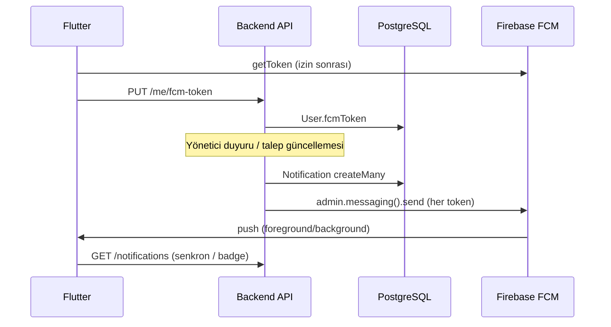

# AidatPanel — Faz 2A Uygulama Planı (Backend + Flutter)

> **Kaynak:** `AIDATPANEL.md`  
> **Hedef:** Gider, talep ve bildirim sisteminin **backend API + Firebase FCM + Flutter entegrasyonu** ile uçtan uca tamamlanması. Mobil ekip, API ve push sözleşmesine göre doğrudan UI bağlayabilsin.  
> **Sözleşme:** `/api/v1` · `mobile/lib/core/constants/api_constants.dart`  
> **Son güncelleme:** 2026-05-19

---

## Proje yapısı (güncel workspace)

Tek repoda **backend + mobil** birlikte tutulur:

```
Deneme/
├── backend/          # Node.js API (Express 5, Prisma 7)
├── mobile/           # Flutter uygulaması (Faz 1 ✅, Faz 2A UI ⬜)
├── docker-compose.yml
├── AIDATPANEL.md     # Master referans
├── PLAN.md           # Bu dosya
├── FLUTTER-BACKEND.md
├── ANALIZ_RAPORU.md  # Kod ↔ doküman analizi (tarihli snapshot)
├── DOKUMANTASYON.md  # Tüm .md dosyaları indeksi ve bütünlük kuralları
├── PLAN_BACKEND_PUSH.md  # Backend push A7–A12 ✅
├── FLUTTER_ENTEGRASYON_PLANI.md  # Mobil ekip / AI (B-ANALYZE → B0–B6)
└── YUSUF_YAPILANLAR_BİLDİRİM.md  # Bildirim checkpoint + Postman notları
```

### Git dalları

| Dal | İçerik |
|-----|--------|
| `main` | Yalnızca `AIDATPANEL.md` |
| `backend/api` | Backend + dokümantasyon (+ `mobile/` birleşik workspace hedefi) |
| `mobile/flutter` | Mobil + (isteğe bağlı) backend birleşimi |

---

## Genel ilerleme özeti (2026-05-19)

| Katman | Faz 1 (MVP) | Faz 2A | Not |
|--------|-------------|--------|-----|
| **Backend API** | ✅ | ✅ | Postman + `test.py` ile doğrulandı |
| **Flutter mobil** | ✅ ~%90 | ⬜ ~%0 | Auth, bina, aidat, profil; FCM/B2–B6 bekliyor |
| **Uçtan uca Faz 2A** | — | 🔶 %50 | Backend hazır; mobil UI bağlantısı yok |

Detaylı gap analizi: `ANALIZ_RAPORU.md`

---

## Özet

| | |
|---|---|
| **Kapsam** | Expense, Ticket, Notification REST API; **zorunlu** Firebase Admin push; Flutter FCM + bildirim/talep/gider katmanları |
| **Kapsam dışı** | Dekont/OCR, fiş dosya upload, RevenueCat kilidi, WhatsApp/SMS, PDF rapor |
| **Tahmini süre** | Backend ~5 gün ✅ · Flutter Faz 2A ~4–5 gün ⬜ · **kalan ~4–5 gün** |
| **Mimari** | Backend: `service` → `controller` → `route` → Zod · Flutter: `data` → `domain` → `presentation` + Riverpod |

---

## Kilitlenmiş kararlar

| Konu | Karar | Gerekçe |
|------|--------|---------|
| **Firebase / FCM** | **Zorunlu** — production’da Admin SDK başlatılmadan sunucu ayakta kalmaz | Push “opsiyonel” değil; bildirim kanalının ikinci kolu |
| Push + DB | Her bildirim olayı: **önce DB `Notification`**, ardından **FCM** (aynı transaction sonrası) | In-app kutu + sistem tepsisi tutarlı |
| FCM env yok (dev) | `NODE_ENV=development` iken uyarı + push atlanır; **production’da `FIREBASE_SERVICE_ACCOUNT_JSON` zorunlu** | Yerel geliştirme esnek, deploy katı |
| Token yok | DB kaydı oluşur; push atlanır (log) — API **200** | Sakin henüz izin vermemiş olabilir |
| Push hatası | DB kaydı **geri alınmaz**; `pushDelivery` log / metrik | Tek kullanıcıda invalid token → diğer alıcılar etkilenmesin |
| Abonelik kilidi | Yok (Faz 2A) | RevenueCat sonrası |
| Gider silme | Kalıcı `DELETE` | Şemada soft-delete yok |
| `receiptUrl` | HTTPS URL string (max 2048) | Upload Faz 2B |
| Bildirim sayfalama | Cursor (`createdAt` + `id`), `limit` 1–50 | |
| Talep durumu | İleri-only geçiş (tablo aşağıda) | |
| `CLOSED` talep | Not yok; status PATCH yok | Terminal |
| Talep notu | Yalnızca `OPEN` / `IN_PROGRESS` | |
| Duyuru alıcıları | Aktif sakinler (`deletedAt` null, `apartmentId` dolu) | |
| Yetki hatası | Mümkünse **404** | |

### Talep durum geçişleri

```
OPEN          → IN_PROGRESS | RESOLVED | CLOSED
IN_PROGRESS   → RESOLVED | CLOSED
RESOLVED      → CLOSED
CLOSED        → (geçiş yok)
```

---

## Firebase mimarisi (uçtan uca)



### FCM `data` payload sözleşmesi (tüm değerler string)

Flutter ve backend **aynı anahtarları** kullanır:

| Anahtar | Örnek | Açıklama |
|---------|--------|----------|
| `type` | `TICKET_UPDATE` | `NotificationType` enum |
| `notificationId` | UUID | Okundu / detay için |
| `ticketId` | UUID | Talep ekranına git |
| `buildingId` | UUID | Bina bağlamı |
| `route` | `/resident-dashboard` | GoRouter hedefi (opsiyonel kısayol) |

`notification` bloğu (title/body) FCM `notification` alanında; `data` deep link için.

### Firebase Console ön koşulları

- [ ] Proje: AidatPanel (mevcut veya yeni)
- [ ] Android: `google-services.json` → `mobile/android/app/`
- [ ] iOS: `GoogleService-Info.plist` → `mobile/ios/Runner/`
- [ ] Cloud Messaging API etkin
- [ ] Service Account JSON → sunucu `FIREBASE_SERVICE_ACCOUNT_JSON` (tek satır veya base64 — **karar: JSON string env**, mevcut `.env.example` ile uyumlu)

---

# BÖLÜM A — Backend

## Aşama A0 — Hazırlık + Firebase bootstrap (1 gün)

**Amaç:** İskelet, erişim yardımcıları ve **Firebase Admin zorunlu init**.

### Görevler

- [x] `backend/src/utils/access.js` — bina/daire/talep yetki yardımcıları
- [x] `backend/src/config/firebase.js` — `initFirebase()`; production’da env yoksa `process.exit(1)`
- [x] `backend/src/services/pushService.js` — `sendToToken`, `sendToUser(userId, payload)`; invalid token → `User.fcmToken = null`
- [x] `package.json` → `firebase-admin` (`npm install` gerekli)
- [x] `index.js` — `connectDB()` sonrası `initFirebase()`
- [x] `validate.js` — `expenseSchemas`, `ticketSchemas`, `notificationSchemas`
- [x] `index.js` mount sırası + boş route iskeletleri

### Mount sırası

```js
app.use("/api/v1/notifications", notificationRoutes);
app.use("/api/v1/tickets", ticketRoutes);
app.use("/api/v1/apartments/:apartmentId/tickets", apartmentTicketRoutes);
// buildings (+ expenses, tickets, announcements), me (+ GET /tickets), ...
```

### Çıkış kriteri

- [x] Production modunda `FIREBASE_SERVICE_ACCOUNT_JSON` olmadan sunucu başlamaz
- [x] Development’ta başlar; push çağrısı env yoksa warn

---

## Aşama A1 — Bildirim servisi + push (1 gün)

**Amaç:** Merkezi servis; **DB + FCM birlikte**.

### Dosyalar (uygulandı)

- `services/notificationService.js` — `createForUsers`: transaction içinde DB kaydı → sıralı FCM
- `services/fcmTokenService.js` — `PUT /me/fcm-token`, invalid token temizliği
- `services/pushService.js` — `sendToToken`, `sendToUser`
- `validators/notificationValidator.js` + `constants/notificationConstants.js`
- `utils/notificationPayload.js` — FCM `data` sözleşmesi
- `controllers/notificationController.js`
- `routes/notificationRoutes.js` — `POST /dev/seed`, `POST /_e2e/seed` (dev/E2E)
- `postman/AidatPanel-Notifications.postman_collection.json`
- `scripts/notificationDemo.js` — `npm run demo:notifications`

### API

| Method | Path |
|--------|------|
| GET | `/api/v1/notifications` |
| PATCH | `/api/v1/notifications/:id/read` |
| PATCH | `/api/v1/notifications/read-all` |

### `createForUsers` akışı (kod)

1. Transaction: her alıcı için `prisma.notification.create`
2. Her alıcı için `fcmToken` varsa `pushService.sendToToken` (`notificationId`, `type`, … `data`)
3. Dönüş: `{ dbCount, pushSent, pushFailed, pushSkipped, notifications[] }`

### Çıkış kriteri

- [x] Liste, okundu, read-all çalışır
- [x] `createForUsers` export — E2E: `AIDATPANEL_E2E=1` + `POST /notifications/_e2e/seed`
- [ ] Gerçek cihazda push (Firebase env + geçerli FCM token ile manuel)

---

## Aşama A2 — Talep API (1–1,5 gün)

*(Önceki plan ile aynı endpoint seti — değişiklik yok)*

| Method | Path | Rol |
|--------|------|-----|
| GET | `/api/v1/buildings/:buildingId/tickets` | MANAGER |
| GET | `/api/v1/me/tickets` | RESIDENT |
| GET | `/api/v1/tickets/:ticketId` | MANAGER \| sahibi |
| POST | `/api/v1/apartments/:apartmentId/tickets` | RESIDENT |
| POST | `/api/v1/tickets/:ticketId/updates` | MANAGER |
| PATCH | `/api/v1/tickets/:ticketId/status` | MANAGER |

### Çıkış kriteri

- [x] Yetki testleri geçer (`test.py` — 403/404)
- [x] CLOSED / geçiş kuralları geçer (400/409)

---

## Aşama A3 — Talep → bildirim + push (0,5 gün)

| Olay | type | Push başlığı (örnek) |
|------|------|----------------------|
| `POST .../updates` | `TICKET_UPDATE` | Talebiniz güncellendi |
| `PATCH` → `IN_PROGRESS` | `TICKET_UPDATE` | Talebiniz inceleniyor |
| `PATCH` → `RESOLVED` | `TICKET_UPDATE` | Talebiniz çözüldü |
| `PATCH` → `CLOSED` | `TICKET_UPDATE` | Talebiniz kapatıldı |

- [x] `ticketService` → `notificationService.createForUsers` (push dahil)

### Çıkış kriteri

- [x] `GET /notifications` — sakin `TICKET_UPDATE` (`test.py`)
- [ ] Gerçek cihazda push (Firebase env + FCM token)

---

## Aşama A4 — Gider API (1 gün)

*(CRUD + summary — önceki plan)*

| Method | Path |
|--------|------|
| GET/POST | `/api/v1/buildings/:buildingId/expenses` |
| GET | `/api/v1/buildings/:buildingId/expenses/summary` |
| PUT/DELETE | `/api/v1/expenses/:expenseId` |

### Çıkış kriteri

- [x] `test.py` gider senaryosu yeşil

---

## Aşama A5 — Yönetici duyurusu + toplu push (0,5 gün)

| Method | Path |
|--------|------|
| POST | `/api/v1/buildings/:buildingId/announcements` |

Yanıt: `{ created, pushSent, pushFailed }`

### Çıkış kriteri

- [x] N sakin → N DB kaydı; token’lı cihazlarda push

---

## Aşama A6 — Backend test ve dokümantasyon (1 gün)

### `test.py`

1. Faz 1 regresyon  
2. Gider CRUD + summary  
3. Talep yaşam döngüsü  
4. Bildirim + `TICKET_UPDATE`  
5. Duyuru + `ANNOUNCEMENT`  
6. Yetki 404  

### Definition of Done (backend)

- [x] Tüm endpoint’ler Zod + Türkçe hata  
- [x] Firebase production’da zorunlu (`initFirebase` — `NODE_ENV=production` + env yoksa çıkış)  
- [x] Her `createForUsers` push dener (`pushService.sendToToken`)  
- [x] `AIDATPANEL.md` API tabloları ✅  
- [x] FCM `data` payload tablosu `AIDATPANEL.md` içinde güncel

### Çıkış kriteri

- [x] `test.py` Faz 1 + Faz 2A senaryoları (gider, talep, bildirim, duyuru, yetki 404)

---

# BÖLÜM B — Flutter

> Backend Faz 2A ✅ tamam. Sıradaki iş: **B0 → B6**. Faz 1 mobil temeli aşağıda özetlenmiştir.

## Faz 1 — Flutter (tamamlandı ✅)

| Özellik | Durum | Not |
|---------|--------|-----|
| Auth (login, register, join, forgot/reset) | ✅ | GoRouter + Riverpod |
| Yönetici: bina, daire, davet, aidat | ✅ | `ManagerDashboardScreen` 4 sekme |
| Sakin: aidatlarım | ✅ | `GET /me/dues` |
| Profil, şifre, dil, hesap silme | ✅ | `SettingsTab` |
| i18n TR/EN (Slang) | ✅ | |
| Dev preview | ✅ | `main_dev.dart` + mock repository |
| Dio + JWT refresh | ✅ | Production URL: `api.aidatpanel.com` |

**Faz 1 bilinçli farklar:** Yönetici 4 sekme (gider/bildirim ayrı tab yok); sakin “Talepler” sekmesi placeholder.

**Hazır ama kullanılmayan:** `ApiConstants` içinde Faz 2 path’leri tanımlı; `firebase_core` / `firebase_messaging` pubspec’te var, init yok.

---

## Faz 2A — Flutter (B0–B6, başlanmadı ⬜)

> **Aşama B1 (Firebase)** en erken başlar; backend API beklemeye gerek yok.

## Aşama B0 — Firebase projesi ve dosyalar (0,5 gün)

### Görevler

- [ ] `flutterfire configure` → `lib/firebase_options.dart`
- [ ] Android: `google-services.json`, Gradle plugin
- [ ] iOS: `GoogleService-Info.plist`, Push capability, background modes
- [ ] `pubspec.yaml`: `firebase_core`, `firebase_messaging` (zaten var — sürüm doğrula)

### Çıkış kriteri

- [ ] `flutter run` — `Firebase.initializeApp` hatasız

---

## Aşama B1 — FCM çekirdek katmanı (1 gün)

### Dosyalar (önerilen)

```
mobile/lib/core/notifications/
├── firebase_bootstrap.dart      # initializeApp, background handler top-level
├── fcm_service.dart             # izin, getToken, onTokenRefresh, listeners
└── notification_payload.dart    # data map → typed model + route
```

### Davranış

- [ ] Uygulama açılışı: `Firebase.initializeApp` (`main.dart` + `main_dev.dart`)
- [ ] İzin: iOS `requestPermission`; Android 13+ `POST_NOTIFICATIONS`
- [ ] Token al → `PUT /api/v1/me/fcm-token` (login sonrası + `onTokenRefresh`)
- [ ] Logout: token backend’de null yapılabilir (opsiyonel `DELETE` yok — PUT boş string **kullanma**; logout’ta sunucu tarafı temizlik ileride)
- [ ] **Foreground:** `FirebaseMessaging.onMessage` → in-app toast veya local banner
- [ ] **Background:** `@pragma('vm:entry-point')` top-level handler → badge / sessiz senkron
- [ ] **Tap:** `onMessageOpenedApp` / `getInitialMessage` → `go_router` (`ticketId` varsa talep detayı)

### Çıkış kriteri

- [ ] Gerçek cihazda token `PUT /me/fcm-token` ile DB’ye yazılır
- [ ] Backend’den test push alınır

---

## Aşama B2 — Bildirim feature (data + UI) (1–1,5 gün)

### Dosyalar

```
mobile/lib/features/notifications/
├── data/
│   ├── models/notification_model.dart
│   ├── datasources/notification_remote_datasource.dart
│   └── repositories/notification_repository_impl.dart
├── domain/
│   ├── entities/notification_entity.dart
│   └── repositories/notification_repository.dart
└── presentation/
    ├── providers/notifications_provider.dart
    └── screens/notifications_screen.dart
```

### API bağlantısı

| Mobil | Backend |
|-------|---------|
| Liste | `GET /notifications` |
| Okundu | `PATCH /notifications/:id/read` |
| Tümü okundu | `PATCH /notifications/read-all` |

**Mobil eksik:** `ApiConstants.notificationsReadAll` sabiti henüz tanımlı değil — B2’de ekle.

### UI

- [ ] Ayarlar’daki “Bildirimler” → gerçek ekran (coming soon kaldır)
- [ ] `unreadCount` badge (provider)
- [ ] Liste: başlık, gövde, tarih, okunmamış vurgu
- [ ] Tap → `type`’a göre yönlendirme (`TICKET_UPDATE` → talep detay)

### Çıkış kriteri

- [ ] Push sonrası liste yenilenince kayıt görünür
- [ ] Okundu işaretleme senkron

---

## Aşama B3 — Talep feature (1–1,5 gün)

### Dosyalar

```
mobile/lib/features/tickets/
├── data/ ... (model, datasource, repository)
├── domain/ ...
└── presentation/
    ├── providers/tickets_provider.dart
    ├── screens/resident_tickets_tab.dart    # dashboard placeholder yerine
    ├── screens/ticket_detail_screen.dart
    └── screens/manager_tickets_screen.dart  # veya bina bağlamında liste
```

### API

| Mobil | Backend |
|-------|---------|
| Sakin liste | `GET /me/tickets` |
| Oluştur | `POST /apartments/:id/tickets` |
| Detay | `GET /tickets/:id` |
| Yönetici liste | `GET /buildings/:id/tickets` |
| Not | `POST /tickets/:id/updates` |
| Durum | `PATCH /tickets/:id/status` |

### Çıkış kriteri

- [ ] Sakin talep açar → yönetici görür → not ekler → sakin push + in-app görür

---

## Aşama B4 — Gider feature (1 gün)

### Dosyalar

```
mobile/lib/features/expenses/
├── data/ ...
└── presentation/
    ├── screens/expenses_list_screen.dart
    └── widgets/expense_form_bottom_sheet.dart
```

### API

| Mobil | Backend |
|-------|---------|
| Liste / ekle | `GET/POST .../buildings/:id/expenses` |
| Özet | `GET .../expenses/summary` |
| Düzenle / sil | `PUT/DELETE /expenses/:id` |

### UI yerleşimi

- [ ] Yönetici: Binalar sekmesi veya bina detayından “Giderler” girişi
- [ ] Aylık özet kartı (kategori dağılımı)

### Çıkış kriteri

- [ ] CRUD + özet ekranda doğru

---

## Aşama B5 — Dashboard entegrasyonu ve `main_dev` (0,5 gün)

- [ ] `resident_dashboard`: Talepler sekmesi → `ResidentTicketsTab`
- [ ] Yönetici: talep/gider kısayolları (ana sayfa veya bina kartı)
- [ ] `main_dev.dart`: mock notification/ticket/expense repository (UI sunucusuz)
- [ ] Slang: `features.notifications`, `features.tickets`, `features.expenses` anahtarları

### Çıkış kriteri

- [ ] Production build: gerçek API + FCM
- [ ] Dev build: mock ile ekran gezintisi

---

## Aşama B6 — Flutter test ve E2E checklist (0,5 gün)

- [ ] Widget / unit: `notification_payload` parse
- [ ] Manuel E2E script (PLAN eki):

| # | Senaryo |
|---|---------|
| 1 | Yönetici giriş → FCM token kayıtlı |
| 2 | Sakin giriş → token kayıtlı |
| 3 | Sakin talep açar |
| 4 | Yönetici not ekler → sakin **push** alır |
| 5 | Sakin bildirim listesinde görür → talebe gider |
| 6 | Yönetici duyuru → tüm sakin push |
| 7 | Gider ekle → listede ve özetde |

---

# Dosya ağacı

### Backend (mevcut ✅)

```
backend/src/
├── config/firebase.js
├── constants/notificationConstants.js
├── validators/notificationValidator.js
├── utils/notificationPayload.js
├── services/
│   ├── notificationService.js, pushService.js, fcmTokenService.js
│   ├── ticketService.js, expenseService.js, announcementService.js
│   └── ...
├── postman/AidatPanel-Notifications.postman_collection.json
└── scripts/notificationDemo.js
```

### Mobile — mevcut vs hedef

| Yol | Mevcut | Hedef (B0–B4) |
|-----|--------|----------------|
| `features/auth`, `buildings`, `dues`, `apartments`, `profile` | ✅ kod | — |
| `features/notifications/` | ⬜ `.gitkeep` | B2 |
| `features/tickets/` | ⬜ `.gitkeep` | B3 |
| `features/expenses/` | ⬜ `.gitkeep` | B4 |
| `core/notifications/` | ⬜ yok | B1 |
| `firebase_options.dart` | ⬜ yok | B0 |

---

# Definition of Done (Faz 2A — tamamı)

### Backend

- [x] Expense, Ticket, Notification API tamam
- [x] Firebase Admin production’da zorunlu
- [x] Her bildirim olayında FCM denemesi
- [x] `test.py` Faz 2A senaryoları eklendi (CI’da sunucu + `python3 test.py` ile doğrulanır)

### Flutter

- [x] Faz 1: Auth, bina, aidat, profil, i18n, dev mock
- [ ] Firebase init + FCM token yaşam döngüsü (B0–B1)
- [ ] Push alınıyor (foreground + background + tap)
- [ ] Bildirim, talep, gider ekranları gerçek API'ye bağlı (B2–B4)
- [ ] `ApiConstants` ile path uyumu (`notificationsReadAll` dahil)
- [ ] `main_dev` mock'ları: notification / ticket / expense (B5)

### Dokümantasyon

- [x] `AIDATPANEL.md` — FCM zorunlu, endpoint ✅
- [x] `PLAN.md` ilerleme tablosu güncel
- [x] `ANALIZ_RAPORU.md` — tam proje analizi
- [x] `YUSUF_YAPILANLAR_BİLDİRİM.md` — bildirim Postman checkpoint
- [x] `DOKUMANTASYON.md` — dokümantasyon indeksi
- [x] `PLAN_BACKEND_PUSH.md`, `FLUTTER_ENTEGRASYON_PLANI.md`

---

# İlerleme takibi

## Backend

| Aşama | Durum |
|-------|--------|
| A0 — Hazırlık + Firebase bootstrap | ✅ |
| A1 — Bildirim + push | ✅ |
| A2 — Talep API | ✅ |
| A3 — Talep → bildirim + push | ✅ |
| A4 — Gider API | ✅ |
| A5 — Duyuru + toplu push | ✅ |
| A6 — Test & dokümantasyon | ✅ |
| A7–A12 — Push tamamlama | ✅ ([`PLAN_BACKEND_PUSH.md`](PLAN_BACKEND_PUSH.md)) |

## Flutter

| Aşama | Durum |
|-------|--------|
| **F1 — MVP (auth, bina, aidat, profil)** | ✅ |
| B0 — Firebase dosyaları | ⬜ |
| B1 — FCM çekirdek | ⬜ |
| B2 — Bildirim UI + API | ⬜ |
| B3 — Talep UI + API | ⬜ |
| B4 — Gider UI + API | ⬜ |
| B5 — Dashboard + main_dev | ⬜ |
| B6 — Test & E2E | ⬜ |

## Öncelik sırası (sıradaki iş)

1. **[`FLUTTER_ENTEGRASYON_PLANI.md`](FLUTTER_ENTEGRASYON_PLANI.md) B-ANALYZE** — güncel tasarım/kod gap raporu
2. **B0–B1** — Firebase + `PUT /me/fcm-token`
3. **B2** — Bildirim listesi (Postman: `backend/postman/`)
4. **B3** — Talep sekmesi (sakin placeholder kaldır)
5. **B4** — Gider UI
6. **B5–B6** — Dashboard, mock, E2E checklist

---

## Sonraki faz (kapsam dışı)

| Faz | İçerik |
|-----|--------|
| 2B | `receiptUrl` dosya upload |
| 2B | Dekont/OCR, `DEKONT_*` push |
| 3 | RevenueCat, WhatsApp, PDF |

---

*Son güncelleme: 2026-05-19 — `mobile/` workspace'e eklendi; backend Faz 2A ✅; Flutter Faz 2A (B0–B6) sırada.*
